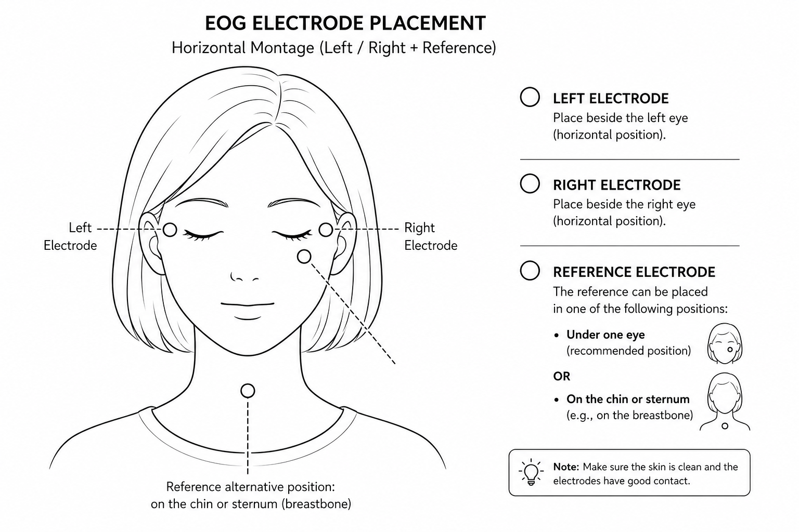

# Helmholtz and the Noisepocalypse

This is an EOG game to test and play with **digital filtering for eye-movement detection**.

You build a signal filter live, calibrate your eye movements, and then steer a nerve impulse
through a three-lane runner using only **left/right glances**.

The signal comes from your eyes via **EOG** (electrooculography), streamed over an ESP32.

## Game Story

You are Professor Hermann von Helmholtz’s assistant, and unfortunately, his latest experiment has gone completely wrong.

The machine is drowning in noise, only one clean nerve impulse remains, and naturally, it is now your job to fix everything.

Build the right filter, rescue the signal, and save Helmholtz’s experiment before the whole lab turns into electrical chaos.

## What it does

One continuous flow from raw signal to analysis:

1. **Filter builder** – pick and tune a filter live (`Raw`, `Highpass`, `EMA Smooth`, `Moving Average`).
2. **Prediction** – guess how the filter will behave (fast-but-noisy / balanced / smooth-but-slow).
3. **Calibration** – guided left/right/center glances set your personal detection thresholds.
4. **Controlled test** – a scientific run measures **accuracy, reaction time, false triggers, and noise reduction**.
5. **Runner** – steer the impulse into the clean (cyan) gate and dodge the red noise artifacts.
6. **Analysis** – all data is saved as CSV in `data/`, plus a time/frequency dashboard (Welch PSD) in `plots/`.

## Hardware

- ESP32 (or another compatible microcontroller)
- AD8232 analog biopotential module (conditions and amplifies the EOG signal)
- Three surface electrodes + electrode cables
- USB cable and a computer running the Python game

## Hardware Setup

<p align="left">
  
</p>

ESP32, AD8232, electrode cables, USB connection and the computer.

| AD8232   | ESP32                    |
| -------- | ------------------------ |
| `3.3V`   | `3V3`                    |
| `GND`    | `GND`                    |
| `OUTPUT` | analog input pin (ADC)   |

## Electrode placement (horizontal montage)

<p align="left">  </p>

Keep the left and right electrodes at roughly the same height so horizontal glances produce a clean,
symmetric deflection.

## Safety

> ⚠️ When electrodes are attached to a person, the measurement
> hardware must not be directly connected to mains-powered equipment.
> Do not use a desktop computer, a charging laptop, a laboratory power supply,
> or a standard oscilloscope without suitable medical-grade isolation.

## Installation

Python 3.10+ recommended.

```bash
python3 -m venv .venv
source .venv/bin/activate          
pip install pygame pyserial numpy pandas matplotlib scipy
```

## Running

1. Plug in the ESP32 and confirm data arrives:
   ```bash
   python read_serial_test.py
   ```
   The terminal should print a stream of numbers (e.g. `2034`, `2041`, …) that change when you move
   your eyes or touch the electrodes. Stop with `Ctrl+C`. If nothing appears, check the port, the
   baud rate (`115200`), the firmware, the USB cable (data-capable), and that no other program holds
   the port.
2. Find your serial port and set `PREFERRED_PORT` in `Helmholtz_Noisepocalypse.py`:
   - **macOS:** `ls /dev/cu.*` → e.g. `/dev/cu.usbserial-0001`
   - **Linux:** `ls /dev/ttyUSB* /dev/ttyACM*` → e.g. `/dev/ttyUSB0`
   - **Windows:** Device Manager → *Ports (COM & LPT)* → e.g. `COM3`

   If exactly one compatible port is found, the game selects it automatically.
3. Start the game:
   ```bash
   python Helmholtz_Noisepocalypse.py
   ```

Runner controls: **glance left/right** (via EOG). The ←/→ arrow keys work as a fallback. `ESC` quits.

## How the filters are built

All four filters live in one place: the `FilterProcessor.process` method in
[Helmholtz_Noisepocalypse.py](Helmholtz_Noisepocalypse.py#L186). Every incoming ADC sample
runs through the same three building blocks, and the selected `filter_type` decides which
result is used:

```python
# 1. Slow baseline estimate (exponential moving average of the raw signal)
self.baseline = alpha * self.baseline + (1.0 - alpha) * raw_value   # alpha = baseline_alpha
highpass = raw_value - self.baseline                                # drift removed

# 2. Exponential smoothing of the high-pass signal
self.smooth = smooth_alpha * self.smooth + (1.0 - smooth_alpha) * highpass

# 3. Moving average over the last N high-pass samples
self.moving_values.append(highpass)
moving_average = mean(self.moving_values)                           # N = moving_average_window
```

The output is then picked per filter type:

| Filter | Construction | Output |
|---|---|---|
| **Raw** | nothing removed | `raw_value` |
| **Highpass** | raw minus slow baseline | `highpass` |
| **EMA Smooth** | high-pass + exponential smoothing | `self.smooth` |
| **Moving Average** | high-pass + boxcar average of `N` samples | `moving_average` |

The tunable parameters (`baseline_alpha`, `smoothing_alpha`, `moving_average_window`) are
defined in the `FilterConfig` dataclass at the top of the file and can be adjusted live in the
filter builder. The helper `approximate_ema_cutoff_hz` translates an alpha value into an
approximate cutoff frequency in Hz, which is what the in-game explanations display.

> Line links such as `#L186` can drift when the Python file changes.

## Project structure

```text
Helmholtz_Noisepocalypse.py   # main game (filter, calibration, test, runner, analysis)
read_serial_test.py           # checks that ADC values arrive from the ESP32
images/                       # game graphics, screenshots, hardware & electrode 
data/                         # raw and event CSV logs (per run)
plots/                        # generated analysis dashboards
results/                      # combined results table
```

## Outputs

Each run writes raw and event CSVs to `data/`, an analysis dashboard to `plots/`, and appends one
row per round to a combined results table in `results/`. The dashboard contains raw vs. filtered EOG
over time, the detected eye-movement events, and a Welch PSD frequency analysis.
